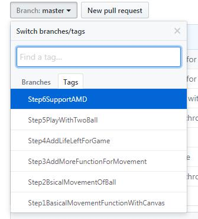

# BreakOut Clone in Js

This is an implementation of classical game break-out clone in javascript.
The purpose of this project:

* Practice with modulization in Javascript

* Log for how to refactor a `bad smell code` into good style implementation with modulization.

With the help of git, I set many tags in the repository to note the key point of the development process: 

**Step1**: Enable reaction of the paddle to the user input on the keyboard. The image will move right or left after you press down the key 'a' or 'd' on the keyboard.   

**Step2**: Add the `Ball` in the context, ball can move and rebound.   
**Step3**: Add reaction of the ball for hitting on the paddle and add the check   function for game over.   
**Step4**: Basic core-function have been finished. More refactor and improve the quility of implementation.   
**Step5**: Do you feel boring for playing with only one ball ? let's add one more :)   
**Step6**：I come to know `AMD (Asynchronous Module Definition)`, refactor into    modulization with [requirejs](http://requirejs.org/).    

Finally, there is the UML of this implementation.   

# 经典弹球游戏实现

[弹球游戏](https://en.wikipedia.org/wiki/Breakout_clone) 的一个实现，本项目的主要目的  

* 熟悉JS模块化编程   

* 记录一个程序如何从一个大饼(shi)转化为"模块化"的结构   

在git的帮助下以tag的形式，记录了程序实现演变的关键点   
**Step1**: 完成基础的键盘输入事件处理函数实现Canvas图层中"移动"图片.按下键盘a和d键移动挡板   
**Step2**: 添加"球"对象，支持球的简单上下运动以及遇到碰撞物之后反弹    
**Step3**: 让“球”和“挡板”的移动关联起来，添加游戏结束判断.    球向下运动如果越过挡板触碰到下边界则游戏结束.    
**Step4**: 基础的核心功能已经完成了,对现有实现进行优化重构以及界面优化   
**Step5**: 一个球无趣，那就来两个:stuck_out_tongue:    
**Step6**：了解到AMD相关知识，借助requirejs对现有实现进行拆分重构   

Finished:   
* 弹球和挡板使用CSS颜色填充即可, 去掉图片   
* 支持拖拽   

TODO:
* 界面添加按钮，方便手机浏览器打开时操作挡板

### 文件简介   

js/ball.js  弹球模块
js/brick.js 砖块模块

### AI训练模块   
* 系统输入: 球当前的状态，挡板当前的状态
`[球速, 球运动的方向, 球的位置, 挡板当前的速度, 挡板当前的方向，挡板当前的位置]`

* 系统输出: 挡板的移动方向
+1: 右移
0 : 不动
-1: 左移

